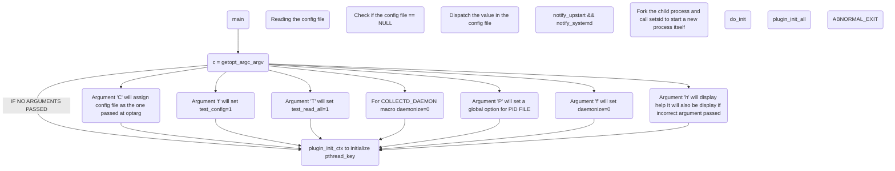

Collectd has a few components that are compiled after running make command, the execs that are made are:
collectd
collectdmon
collectd-nagios
collectd-tg
collectdctl

Descriptions:
collectd: This is the system statistics daemon that receives the system statistics from defined resources through number of ways. The main daemon only performs loading, querying, and submitting to plugins.
The main source of gathering this information is through a "Plugin"

Important functions:
pthread_key_create: This is needed to manage the different static variables and the different global variables that belong to N threads. pthread_key_create allocates a new TSD key which helps access TSD (Thread Specific Data) area which is Private area of thread.
void * are assosciated to TSD Keys.

plugin_init_all: Will initialize plugins and start reader#N and writer#N threads

collectdmon: 
This is the monitoring daemon for collectd. It acts as a small wrapper daemon which starts and monitors the collectd daemon. If collectd terminates it will be automatically restarted unless collectdmon was told to shut it down.

collectd-nagios:
Nagios plugin for querying with collectd. (Need to see working and uses)

collectd-tg:
This is the traffic generator of collectd which generates bogus traffic. It mimics real traffic as much as it can.

collectdctl:
This is the control interface of collectd that provides control interface for collectd, which may be used to interact with the daemon itself. This is done through the "unixsock plugin".

